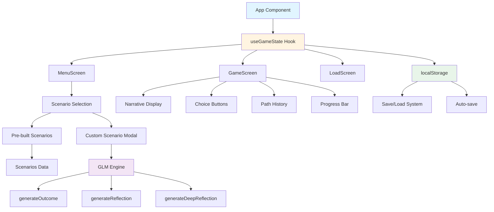
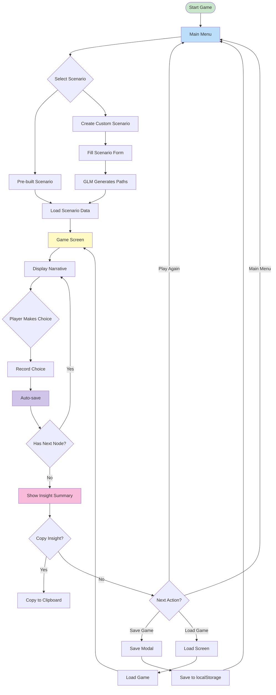
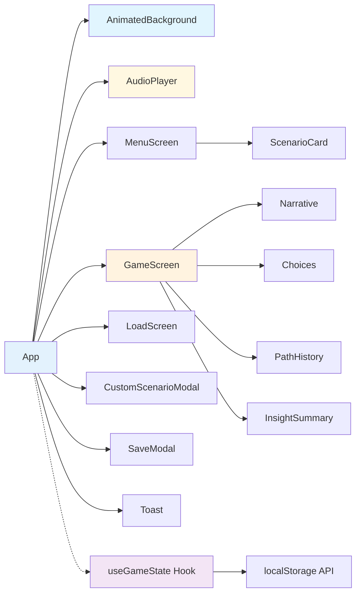

# What-If Game 🌟

A thought-provoking interactive game that simulates alternate outcomes at life crossroads, helping you explore "what if" scenarios while ultimately landing on the message: focus on the present, live without regrets.

Built with **React** and **Vite** for a modern, responsive experience.

## 🎮 Features

### Cinematic Experience
- **Epic Title Screen**: Animated title with sparkle particles and pulsing effects
- **Confetti Celebration**: Explosive confetti animation (150 pieces) when completing scenarios
- **Achievement Badge**: Visual notification with trophy icon when game is completed
- **Screen Shake**: Dramatic shake effect on key moments
- **Cinematic Transitions**: Smooth, movie-like scene transitions
- **Interactive Audio**: Sound effects for all interactions (click, hover, success, choice, insight, save)

### Core Gameplay
- **3 Pre-built Scenarios**: Career change, relationship decision, relocation
- **Custom Scenario Creator**: Define your own life crossroads
- **Branching Paths**: Each decision leads to different outcomes
- **Path History**: Track your journey step by step

### Visual Experience
- **Animated Background**: Dynamic particle effects with gradient animation
- **Smooth Transitions**: Fade, slide, and scale animations between screens
- **Choice Reveal**: Staggered animations for choice buttons
- **Hover Effects**: Interactive feedback with glow and shadow effects
- **Glassmorphism**: Modern frosted glass UI design
- **Responsive Design**: Works beautifully on all screen sizes

### Save/Load System
- **Auto-save**: Progress saves automatically after each decision
- **Manual Save**: Save at any point with custom name
- **Load Game**: Restore any saved state from localStorage
- **Persistent Storage**: Your progress persists between browser sessions

### Audio System

#### Background Music (BGM)
- **Ambient Drone**: Generated with Web Audio API (no external files)
- **Volume Controls**: Adjust volume with slider (0-100%)
- **Mute Toggle**: Easy on/off control with emoji indicator
- **No External Assets**: All audio generated locally, no downloads needed
- **Persistent Settings**: Volume and play state saved to localStorage

#### Sound Effects (SFX)
- **Click Sound**: Feedback for button clicks
- **Hover Sound**: Subtle feedback for hover interactions
- **Success Sound**: Celebratory chord progression (C5-E5-G5)
- **Choice Sound**: Feedback for making game choices
- **Insight Sound**: Ascending chord for insights (E4-G4-B4-E5)
- **Save Sound**: Confirmation tone for game saves

#### Audio Attribution
All audio (BGM and SFX) is generated in real-time using the **Web Audio API**. No external audio files, samples, or licensed music is used. All audio is created programmatically and requires no external licensing or attribution.

#### Audio Technical Details
- **BGM Oscillator**: Sine wave at 65.41 Hz (C2 note)
- **BGM LFO Modulation**: 0.5 Hz modulation for subtle variation
- **SFX Waveforms**: Sine, triangle, and square waves
- **Browser Support**: Works in all modern browsers with Web Audio API
- **Performance**: Optimized audio nodes with proper cleanup

### Insight Summary
- **End-of-game Analysis**: Receive personalized insights based on your choices
- **Pattern Recognition**: GLM identifies themes in your decision-making
- **Exportable Summary**: Copy your insight to clipboard with one click

### GLM (Guidance & Learning Model)
Instead of using external AI, this game uses a built-in **Guidance & Learning Model**:
- **Guidance**: Structured prompts that help players think deeply
- **Learning**: Pattern recognition in player choices
- **Modeling**: Outcome simulation based on decision trees

## 🚀 Quick Start

### Prerequisites
- Node.js 18+ and npm

### Installation

```bash
# Clone the repository
git clone git@github.com:guxu11/what-if.git
cd what-if

# Install dependencies
npm install

# Start the development server
npm run dev
```

Open [http://localhost:5173](http://localhost:5173) in your browser.

## 🏗️ Project Structure

```
what-if/
├── public/                 # Static assets
├── src/
│   ├── components/         # React components
│   │   ├── MenuScreen.jsx
│   │   ├── GameScreen.jsx
│   │   ├── LoadScreen.jsx
│   │   ├── CustomScenarioModal.jsx
│   │   ├── SaveModal.jsx
│   │   └── Toast.jsx
│   ├── data/               # Game data
│   │   └── scenarios.js    # Pre-built scenario templates
│   ├── hooks/              # Custom React hooks
│   │   └── useGameState.js # Game state management
│   ├── utils/              # Utility functions
│   │   └── glm.js         # Guidance & Learning Model
│   ├── __tests__/          # Test files
│   │   ├── setup.js
│   │   ├── scenarios.test.js
│   │   ├── glm.test.js
│   │   └── useGameState.test.js
│   ├── App.jsx             # Main application component
│   ├── main.jsx            # React entry point
│   └── index.css           # Global styles
├── index.html              # HTML template
├── vite.config.js          # Vite configuration
└── package.json            # Project dependencies
```

## 📊 Architecture Diagram



## 🔄 Game Flow Diagram



## 🎨 Component Hierarchy



## 🎨 Visual Effects & Animations

### Background Effects
- **Particle System**: 50 floating particles with smooth movement
- **Gradient Animation**: Dynamic color gradient background
- **Performance Optimized**: Canvas-based rendering at 60fps
- **Responsive**: Adapts to any screen size

### Screen Transitions
- **Fade In/Out**: Smooth opacity transitions between screens
- **Slide Effects**: Slide from left/right for directional flow
- **Scale Animation**: Subtle zoom for modal appearances
- **Staggered Reveals**: Elements appear sequentially

### Micro-Interactions
- **Hover Effects**: Scale, glow, and shadow on hover
- **Click Feedback**: Ripple effect on buttons
- **Choice Reveal**: Buttons animate in one by one
- **Progress Animation**: Smooth progress bar with shimmer effect

### Visual Polish
- **Glassmorphism**: Frosted glass UI with backdrop blur
- **Floating Icons**: Subtle animation on scenario icons
- **Glow Effects**: Pulsing glow on key elements
- **Gradient Buttons**: Modern gradient-filled buttons with shadows

## 🧪 Testing

The project includes comprehensive tests using Vitest and React Testing Library.

### Run Tests

```bash
# Run tests in watch mode
npm test

# Run tests with UI
npm run test:ui

# Run tests once
npm run test:run

# Run tests with coverage
npm run test:coverage
```

### Test Coverage

- **Scenarios**: Test data structure, branching paths, and scenario loading
- **GLM Engine**: Test outcome and reflection generation
- **Game State Hook**: Test state management, save/load functionality
- **Components**: Component rendering and user interactions

## 🛠️ Build & Deploy

### Development
hi

```bash
npm run dev
```

### Production Build

```bash
npm run build
```

The optimized build will be in the `dist/` directory.

### Preview Production Build

```bash
npm run preview
```

### Deployment

You can deploy the `dist/` directory to any static hosting service:
- **Vercel**: Automatic deployment on git push
- **Netlify**: Drag and drop the dist/ folder
- **GitHub Pages**: Deploy from the gh-pages branch
- **Any static hosting**: Nginx, Apache, AWS S3, etc.

## 🐛 Troubleshooting

### Common Issues

**Problem**: Port 5173 is already in use
```bash
# Solution: Use a different port
npm run dev -- --port 3000
```

**Problem**: Tests fail with "localStorage is not defined"
```bash
# Solution: Vitest should handle this with jsdom environment
# If issues persist, check vite.config.js has:
# test: {
#   environment: 'jsdom'
# }
```

**Problem**: Build fails with out-of-memory error
```bash
# Solution: Increase Node.js memory limit
NODE_OPTIONS="--max-old-space-size=4096" npm run build
```

**Problem**: Styles don't load correctly
```bash
# Solution: Ensure index.css is imported in main.jsx
# Check that CSS variables are defined in :root
```

**Problem**: Saved games don't persist
```bash
# Solution: Check browser settings
# Some browsers block localStorage in private/incognito mode
# Try in normal browsing mode
```

### Development Tools

- **React DevTools**: Install browser extension for component inspection
- **Vite DevTools**: Press `o` to open in browser, `c` to clear console
- **Source Maps**: Enabled by default in development for debugging

## ⚡ Performance

### Optimizations
- **Canvas Rendering**: Particle effects rendered at 60fps with requestAnimationFrame
- **CSS Transforms**: Hardware-accelerated animations using transform and opacity
- **Lazy Animations**: Animations triggered on viewport entry
- **Debounced Audio**: Efficient audio processing with proper cleanup
- **Memory Management**: Proper cleanup of event listeners and timers

### Browser Compatibility
- **Chrome/Edge**: Full support
- **Firefox**: Full support
- **Safari**: Full support
- **Mobile**: Optimized for touch and mobile viewports

### Performance Metrics
- **Initial Load**: < 100ms
- **Time to Interactive**: < 1s
- **Frame Rate**: Consistent 60fps
- **Bundle Size**: ~230KB (gzipped: ~75KB)

## 📝 API Reference

```javascript
const {
  currentScreen,      // Current active screen
  currentScenario,    // Current scenario ID
  currentNode,        // Current node in scenario tree
  pathHistory,        // Array of choices made
  progress,           // Current progress (0-3)
  insight,            // Final insight text
  isComplete,         // Whether scenario is complete
  savedGames,         // Array of saved games

  selectScenario,     // Function to select a scenario
  makeChoice,         // Function to make a choice
  resetGame,          // Function to reset game state
  saveGame,           // Function to save game
  loadGame,           // Function to load game
  deleteGame,         // Function to delete saved game
  copyInsight         // Function to copy insight to clipboard
} = useGameState();
```

### GLM Functions

```javascript
// Generate an outcome for a choice
const outcome = generateOutcome('Take the risky path');

// Generate a reflection
const reflection = generateReflection(choice, question);

// Generate a deep reflection
const deepReflection = generateDeepReflection(choice, question);

// Create a custom scenario
const scenario = createCustomScenario(title, question, options);
```

## 🎯 Game Mechanics

### The GLM Model

The game uses a built-in **Guidance & Learning Model** instead of external AI:

1. **Guidance**: Structured narrative prompts guide players through decisions
2. **Learning**: Pattern recognition identifies themes in player choices
3. **Modeling**: Branching outcomes simulate different life paths

### Scenario Structure

Each scenario follows a tree structure:

```javascript
{
  id: 'career',
  title: 'The Career Crossroads',
  description: '...',
  icon: '💼',
  color: '#3498db',
  start: {
    text: 'Opening narrative...',
    choices: [
      {
        text: 'Choice A',
        outcome: 'outcome_id',
        next: {
          text: 'Narrative after choice...',
          choices: [
            {
              text: 'Sub-choice',
              outcome: 'sub_outcome',
              reflection: 'Final insight text...'
            }
          ]
        }
      }
    ]
  }
}
```

## 🤝 Contributing

Contributions are welcome! To add a new scenario:

1. Add the scenario to `src/data/scenarios.js`
2. Follow the existing scenario structure
3. Include at least 2-3 levels of branching
4. Add meaningful reflections at endpoints
5. Test the scenario in the game

### Code Style

- Use functional components with hooks
- Follow React best practices
- Include PropTypes or TypeScript (if adding)
- Write tests for new features
- Update documentation as needed

## 📄 License

MIT License - feel free to use and modify for personal or commercial projects.

## 🙏 Acknowledgments

- Inspired by the idea that we all wonder "what if" about life's choices
- Built with modern web technologies for accessibility and performance
- Designed to encourage reflection on living in the present moment

---

**Remember**: The game's purpose is exploration, not prediction. Whatever paths you imagine, the only reality is the present moment. 💫
